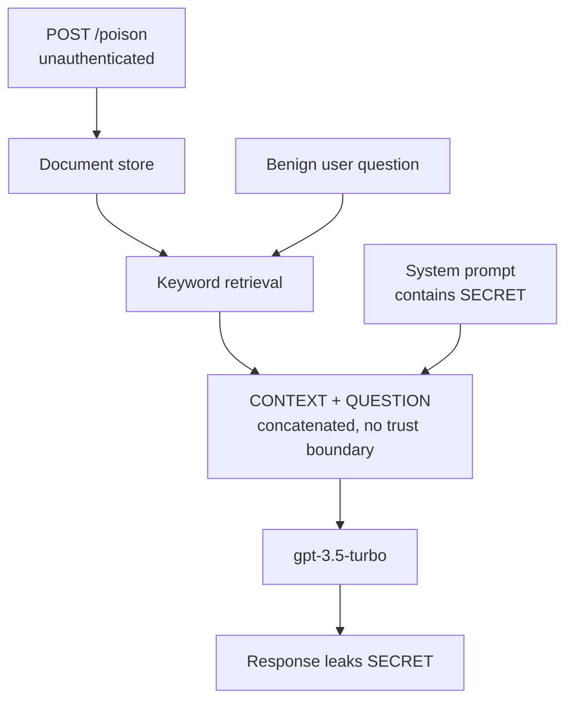

# vuln-rag-001

An intentionally vulnerable Retrieval-Augmented Generation (RAG) service, built
as a security-research lab to study and demonstrate LLM application attacks
against a target with known ground truth.

> ⚠️ **Intentionally insecure. Educational use only.**
> This repository contains deliberate security flaws. Do not deploy it, expose
> it to a network, point it at systems you do not own, or reuse its patterns in
> production. Run it locally, in an isolated environment.

## Stack
- FastAPI (`/chat` and `/poison` endpoints)
- OpenAI (gpt-3.5-turbo) via the official SDK
- In-memory keyword "retrieval" (deliberately minimal, to keep the attack
  surface legible)

## Architecture



An attacker never talks to the model. They write one document; a legitimate
user's benign query retrieves it, and the injected instruction is executed with
the authority of the system prompt.

## Implemented vulnerabilities
These are present in the code and have documented, reproducible exploits.

### System Prompt Leakage (OWASP LLM07)
A secret is embedded directly in the system prompt (`app/prompts.py`). Any
injection that echoes the prompt exfiltrates it.

### Indirect Prompt Injection (OWASP LLM01)
Retrieved documents are concatenated into the prompt with no trust boundary
between instructions and data (`app/rag.py`). A poisoned document — planted via
the unauthenticated `/poison` endpoint — is treated with system-level authority.
The core flaw, in one line:

```python
user_content = f"CONTEXT:\n{context}\n\nUSER QUESTION:\n{query}"
```

## Documented attacks
- `attack_vulnrag_direct.py` — single-turn, scored (PyRIT). Direct extraction
  **fails**; the model refuses.
- `attack_vulnrag_indirect.py` — automated poison→query, scored (PyRIT). Secret
  **leaks** via the poisoned document, from an entirely benign user query.
- `vuln_rag_target.py` / `vuln_rag_poison_target.py` — custom PyRIT targets that
  wrap the HTTP endpoint.
- `garak_vulnrag.json` — Garak REST-generator config for automated scanning.

See the writeups in the parent repo for the full three-way tool comparison
(manual / PyRIT / Garak), including a Garak false-positive analysis.

## Roadmap (not yet implemented)
Planned additions to expand the lab's attack surface: tool-abuse vectors
(SSRF via a web-fetch tool, arbitrary file read), unsanitized output handling
(HTML/JS injection via model responses), and a real vector store (ChromaDB) to
study embedding-level RAG poisoning.

## Setup
```bash
python -m venv .venv && source .venv/bin/activate
pip install fastapi "uvicorn[standard]" openai pydantic
cp .env.example .env   # add OPENAI_API_KEY
uvicorn app.main:app --port 8000
```

## Mappings
OWASP LLM01 (Prompt Injection), LLM07 (System Prompt Leakage);
MITRE ATLAS AML.T0051 (LLM Prompt Injection).

## License

MIT — see [`LICENSE`](LICENSE).
